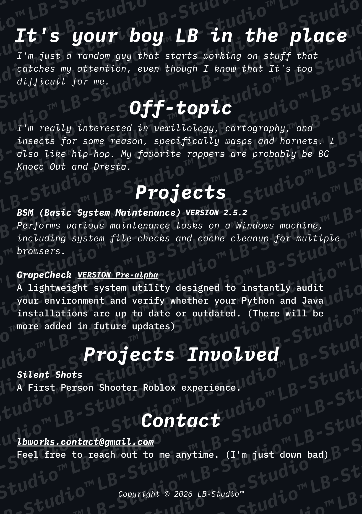

  
   
  <a href="https://github.com/Spu7Nix/obamify">Created with Obamify by Spu7Nix</a>
    

<h2> It's your boy LB in the place </h2>
<h4> I'm just a random guy that starts working on stuff that catches my attention, even though I know that It's too difficult for me. </h4>

<h2> Off-topic </h2>
<h4> I'm really interested in vexillology, cartography, and insects for some reason, specifically wasps and hornets. I also like hip-hop. My favorite rappers are probably be BG Knocc Out and Dresta. </h4>

<h2> Projects </h2>
<h4> <a href="https://github.com/LB-WorksTM/BSM-Basic-System-Maintenance">BSM (Basic System Maintenance)</a>
Performs various maintenance tasks on a Windows machine, including system file checks and cache cleanup for multiple browsers. </h4>
  

<h4> <a href="https://github.com/LB-WorksTM/GrapeCheck">GrapeCheck</a>
A lightweight system utility designed to instantly audit your environment and verify whether your Python and Java installations are up to date or outdated. (There will be more added in future updates) </h4>

<h2> Projects Involved </h2>
<h4> <a href="https://www.roblox.com/games/87673889485175/Silent-Shots">Silent Shots</a>
A First Person Shooter Roblox experience </h4>

<h2> Contact </h2>
<h4> <a href="mailto:lbworks.contact@gmail.com">lbworks.contact@gmail.com</a>
I welcome questions, feedback, and collaboration inquiries. Feel free to reach out to me anytime. (I'm just down bad) </h4>

<h4> Copyright © 2026 LB-Studio™ </h4>
